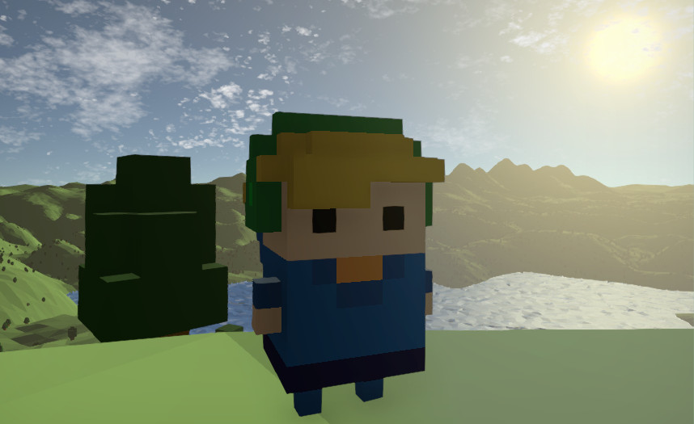
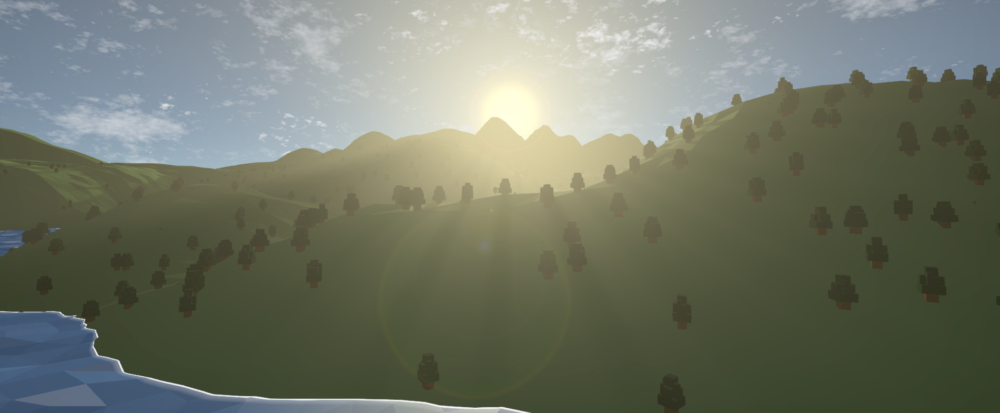
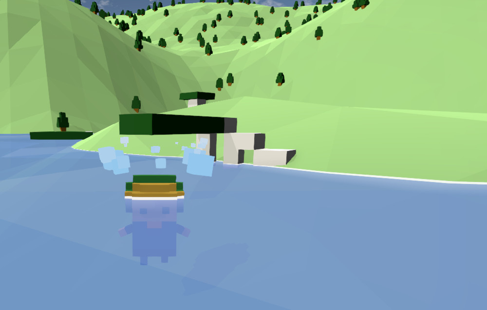
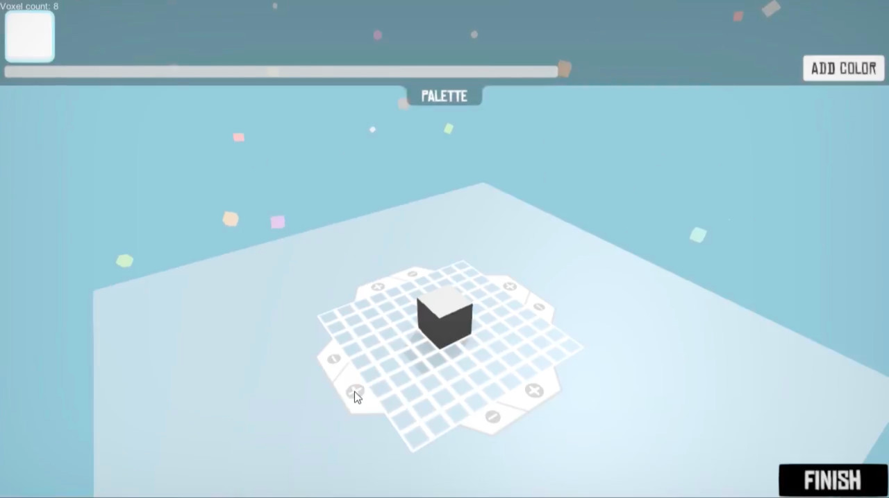
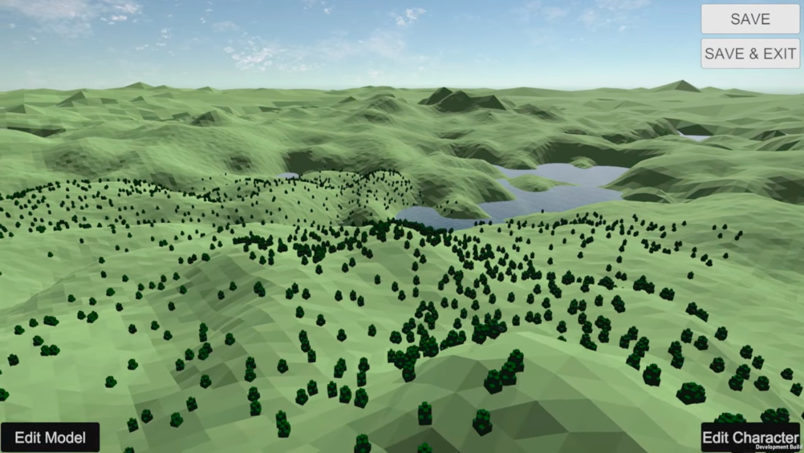

# Untitled Voxel Game, 2017

## A note from the Future (2023)

Hello! I recently found the source code to one of my largest Unity3D projects, and thought it would be worth sharing here for posterity and educational purposes. While the game was never released, I'm reasonably proud of the features that I did get working, and the code might come in handy for future projects. (Ideally, each 'cool feature' would be pulled out into its own repository, but I don't really have time to make/maintain those right now.)

Fair warning: this code was written when I was 17yo, and with about 2 years of coding experience. While it does everything it needs to, there will be issues with class design, lack of comments and code layout, which I do not intend to fix right now. I hope that if you can get it running inside the Unity editor then the Scene layouts will help you understand the project.

Thanks and have fun!

\- Sam

## Some cool features of this game

- Infinite\* random world with configurable, layered Simplex noise and distance-based LOD.
  - Inspired by Kerbal Space Program's terrain engine, a world tile can be generated at various 'octaves', with additional vertices at the edges to ensure they join properly to neighbouring meshes (this was a massive pain!)
  - See `NoiseGenerator.cs`,`TerrainChunk.cs`, `WorldTerrainGenerator.cs`
- Parse Magicavoxel .VOX or .XRAW files & convert into Unity meshes via greedy mesh generation.
  - (works for at least Magicavoxel v0.99)
  - See `VoxelModel.cs`, `VoxelModelIO.cs`, `VoxelMesh.cs`.
- In-game voxel art editor
  - See `VoxelEditor.cs` and the `VoxelEditorMulti.unity` scene.

## Roadmap

_(I'm almost certainly not going to be working on this again but here's some things I think would be cool)_:

- Triplanar textures (so the side of hills don't look as grassy, or so you can add snow to the top)
-
- Multiplayer (sync seeds for worldgen & object placement via IPC, save/load via server instead of zip file, sync player movement with usual object tracking)

## Gallery

_(^from an earlier build, just to demonstrate the world tile LOD system)_

## Setup

_This project was made in Unity 5.5.1. Any 5.5+ version should work (plus maybe 2017.X), but anything newer than that will probably need wrt shaders, deprecated Components etc._

1. Create a new empty Unity project
1. Clone this repo into that project
   - (I _think_ this is the right order because Unity is not happy creating a project in a nonempty directory).
1. Download and import the following plugins/assets:

   - Standard Assets for Unity 5
     - (I don't know how many of these resources are actually used but maybe worth importing them all and deleting from there.)
   - [Post-processing Stack v1](https://github.com/Unity-Technologies/PostProcessing/releases/tag/1.0.3) by Unity Technologies
   - [[BFW]SimpleDynamicClouds](https://assetstore.unity.com/packages/tools/particles-effects/bfw-simple-dynamic-clouds-85665) by ButterflyWorld

   - [KinoFog](https://github.com/keijiro/KinoFog) by keijiro
   - [UCLA Wireframe Shader](https://assetstore.unity.com/packages/vfx/shaders/directx-11/ucla-wireframe-shader-21897) by The UCLA Game Lab
   - [VolumetricLights](https://github.com/SlightlyMad/VolumetricLights/tree/master/Assets/Prefabs) by SlightlyMad
   - [Interpolate.cs](https://github.com/TrackMan/Unity.Package.Interpolate) by Fernando Zapata
   - [Newtonsoft.Json.dll](https://www.newtonsoft.com/json) by Newtonsoft
   - [Ionic.Zip.dll](https://www.nuget.org/packages/Ionic.Zip/) by Peter Dolkens
   - _(The 'Lens Flares 5' package by Unity Technologies is also required but unavailable on the Asset Store, so I've included it in this repo.)_

1. Build and run :)

## Notes/quirks

- I've removed the sound effects/anything I might not have rights to redistribute

- VoxelEditorMulti is an editor for multiple models at once, whereas VoxelEditor only supported one model. The former was needed to support editing character models/anything with multiple 'parts' (models), and the latter can probably be deleted.
